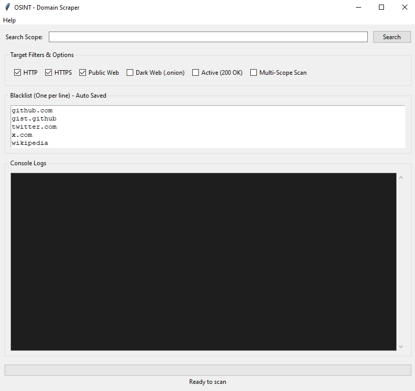
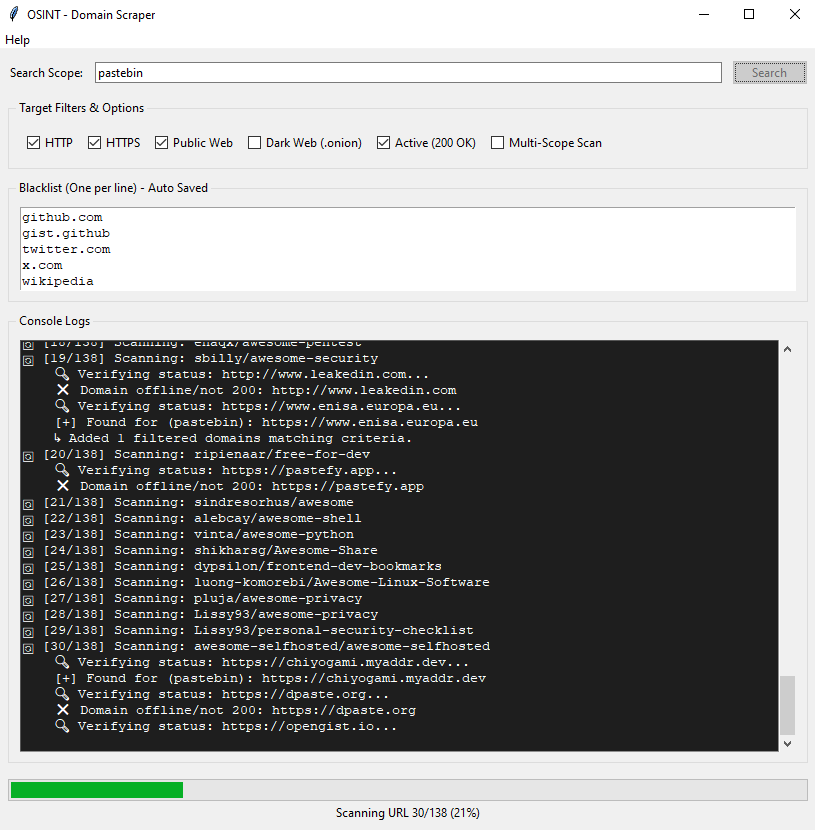
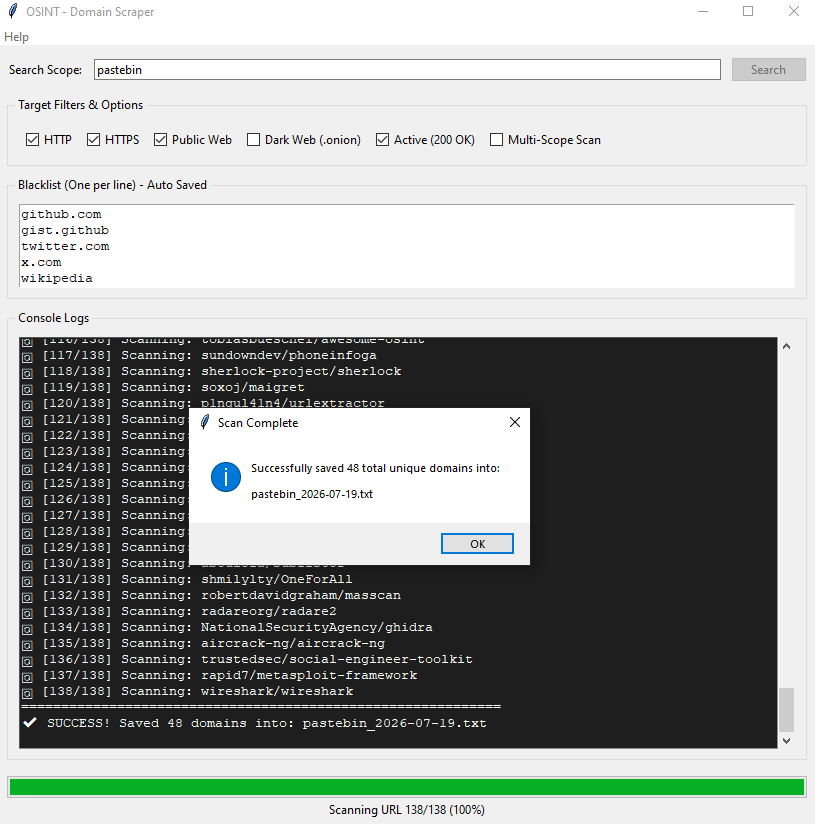

# OSINT - Domain Scraper 🔍🌐

An advanced, multi-threaded GUI tool designed for Security Researchers, Threat Intelligence Analysts, and Bug Bounty Hunters to automate the reconnaissance phase by gathering, filtering, and validating target domains from multiple open-source feeds.

Buy a license: https://salla.sa/abdulsalam-alnuwaysir-dev/osint-domain-scraper/p1716034324

---

## 💡 Features

* **⚙️ 138 Built-in Customizable Sources:** Comes pre-loaded with 142 trusted open-source OSINT intelligence feeds. You can dynamically add or delete URLs directly through `sources.txt` to tailor scans to your project's scope.
* **🔍 Multi-Scope Scanning:** Scan for multiple keywords/target brands simultaneously by simply separating them with a comma (e.g., `google, target, admin`).
* **☑️ Advanced Protocol & Network Filtering:**
    * Toggle HTTP / HTTPS.
    * Target Public Web or Onion Networks (.onion).
    * Validate live hosts only (Saves only domains returning `HTTP 200 OK`).
* **🚫 Real-Time Auto-Saving Blacklist:** Easily exclude noisy or irrelevant domains (like social media networks or content distribution channels) using the in-app blacklist editor. Changes automatically write back to `black_list.txt`.
* **📂 Dynamic Output Organization:** Outputs are cleanly separated into unique text files categorized by the specific scope keyword and stamped with the exact scan date: `[scope]_[YYYY-MM-DD].txt`.
* **⚡ Multi-Threaded Performance:** Performs domain extraction and live host validation concurrently, ensuring the UI remains smooth, fully responsive, and fast.

---

  

  

  

